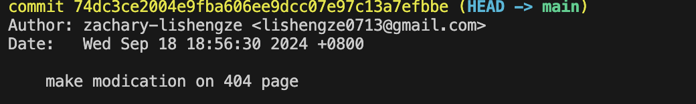

# SRA Software Department Recruitment Lab 2024
在Markdown中#用于创建标题。#为一级标题 ##为二级标题 ###为三级标题。
Welcome to the **SRA Software Department Recruitment Lab 2024**! This repository is designed to evaluate your learning ability. Please note that we are not testing your programming skills, so relax and focus on the tasks at hand.
粗体使用**或者——来标记
We will be judging you based on various aspects throughout this activity. If you encounter issues, please take note of how you resolve them. You can also ask your team members in the group chat for help. Your ability to communicate effectively and assist others will be considered as part of the evaluation process for your application.

## Requirements
这是二级标题
Before you begin the lab, please ensure you have the following set up:
左侧的一个个小数字是行号，有不限于以下的用处1.便于引用交流2.帮助编码人员定位错误等3.辅助人们更方便的阅读。很小却很伟大的发明。
- **Git**: Ensure that Git is installed and properly configured on your computer. This means you should have your user information (such as your email and name) set up.
   > tutorial references:  [git and github, en](https://www.youtube.com/watch?v=hrTQipWp6co)
   or [一小时git教程, zh-CN](https://www.bilibili.com/video/BV1HM411377j/?spm_id_from=333.337.search-card.all.click). 
- **GitHub Account**: You will need a GitHub account to participate in this lab. If you don’t have one, please create it [here](https://github.com/join). 
- **Technical Stack**: Make sure you have the necessary tools and software installed on your computer. 
- **Any IDE or Code Editor**: You can choose any code editor if you like, we would recommend you to use vscode, it is open source and lightweight.
- Knowledge of Basic Shell Commands and Markdown: Familiarity with basic shell commands and Markdown (MD) syntax is required.
   > tutorial references:    
   [30分钟Shell光速入门教程, zh-CN](https://www.bilibili.com/video/BV17m411U7cC/?spm_id_from=333.337.search-card.all.click).   
   关于 MD 语法，问 [gpt](https://chatgpt.com/) 就行。多写多看，也就会了，没必要专门去学，看教程。
-是用来方便阅读的    >是用来创建引用块儿的，引用块即他人的话，或者是为了突出某个文本。

## Instructions
二级标题啦啦啦

If you have previously contributed to any open source community or worked on side projects, and you are applying for a coder position, you can bypass some of the lab tasks.

### Administor and Project leader
1. **Create a Markdown File**: Create a `your-repo-name.md` file in this repository. file指我们存储的数据集合，可以包含文本，图像等。
2. **Link Your Repository**: In the Markdown file, provide links to your repository.
3. **Find Your Project Member**: You should ensure that others can deploy your project locally and make modifications based on it. To facilitate this, provide a brief tutorial on how to work with your project. Additionally, you need to find someone to deploy your project. This involves persuading them to use your project, assisting them with any issues they encounter, and tracking their progress.

### Coder
1. **Ask for permission**:  
   - Ask for permission. Leave your github account username to us. This is for you to easily push your own branch to our repo. 

2. **Create your own `git branch`**:
  - Before you start your code journey. In the project root directory (`path-to-your-project/`), you just cloned it from step 1, create a new branch called(`position/your-name` like `coder/rupert`)  /符号的作用严重依赖上下文，上文的/`的含义我认为应该是注释的结束

3. **Create a Directory Called `projects`(alternative)**:  
   Create a folder named `projects` in the main directory of this repository if you want to clone more than a single project. Then, you can use it to record your coding journey of different repo. If you just want to clone one project and make modifications, you are suggested to directly add your `your-repo-name.md`. 反引号用于表示行内代码（在Markdown中）

     ```
     .
     ├── README.md
     └── projects
         ├── react-documentations-website.md
         ├── wku-sra-wiki.md
         └── ...
     
      
     ```
     or

      ```
      .
      ├── README.md
      └── react-documentations-website.md
      
      ```
这不是顿号，这叫反引号，是来包裹代码的。三个反引号的连用中包裹的是代码块
4. **Find and Clone an Open Source Project**:
  - Choose an open-source project from the following options, as they are generally easier to deploy than other projects, and do not assume you have prior programming knowledge. If you prefer, you can deploy any project of your choice, or select your own project if you are applying for a project leader or administrator position:
     - [React Documentation Website](https://github.com/reactjs/react.dev)
     - [Flutter Documentation Website](https://github.com/flutter/website)
   - Fork the project to your [own repo](https://github.com/WKU-SRA-Dev/website) like this one we show you.
   - Clone the chosen project **FROM YOUR OWN FORKED REPO** into your local, and you will develop based on that repo, you are recommended to use another directory to clone this repo, because that will keep your git repo clear.  
   If you are in the lab directory, with the previous example:
   
   ```bash
   cd .. cd..的作用是可以快速切换到之前的目录
   git clone git@github.com:WKU-SRA-Dev/website.git
   ```
   
   This may be our lab repo:
   ```
   ~/sra-recruitment-lab ~/表示用户的主目录
   ```
   This may be the repo you cloned:   
   ```
   ~/website
   ```
   bonus: ~ represents the home directory of the current user. bonus在代码中表示变量名的含义

You can find instructions on how to deploy the project locally in the respective repositories.


5. **Make Changes Based on the Project You Cloned**:
   - Modify the cloned project to demonstrate your ability to quickly understand and work with an unfamiliar codebase.
   - Capture screenshots of your changes.
   - Return to the lab project
   - Summarize what you did and what you learned in the `*.md` file or you can use it to record anything, which happened in your coding journey
   - Save these screenshots in a separate folder named `img` within the root directory of this repository. The folder structure should look like this:
     ```
     .
     ├── README.md  这是一个常见的文件名，常用于向用户或者开发者提供有关项目的重要信息。
     ├── projects
     │   ├── react-documentations-website.md
     │   ├── wku-sra-wiki.md
     │   └── ...
     │
     └── img  img表示图表的意思。
         ├── change-the-home-page.png
         ├── others.png
         └── ...
     ```
     or
      ```
      .
      ├── README.md
      ├── react-documentations-website.md
      └── img
          ├── change-the-home-page.png
          ├── others.png   .png是表示图像文件采用PNG格式的一个文件扩展名。（无损压缩，用处广泛，色彩丰富）
          └── ...
      ```

6. **Submit Your Changes To Your Forked Repo**:  
   - Commit your changes to your forked repository(you cloned as the project you are developing, **not the lab** (`path-to-your-cloned-repo/`).
   - push your commits to your own remote repo (the forked repo)    

   >You should have a clear description of what you did in your commit message. The commit message will show your commit time, so keep contributing during the labs. Do not try to finish within 2 hours : )

     ！通常表示“非”的含义
   
7. **Submit this lab**:  
  - ENSURE YOU ARE ON YOUR OWN BRANCH like `coder/rupert`
  - commit all your changes 
  - push to our lab repo, ensure you have accepted our collaborator invitation

### Submit Example
[example](https://github.com/WKU-SRA-Dev/sra-recruitment-lab/tree/coder/stewie)

### Bonus Section

The above tasks are intended to assess your ability to learn unfamiliar topics, particularly in situations where you may have no prior experience in programming. The following are additional bonus tasks. While they are not the primary criteria for our selection process, excellent works in these tasks can set you apart from your peers in a competitive environment.
- Set up a `.devcontainer` for this repo. You need to provide a base Linux image; Alpine is recommended because it is lightweight. Then, help your peers who do not have a Unix system use this devcontainer. You need to contribute your config file to the main branch. Git conflicts may happen at any time, so you must know how to resolve them and help your peers resolve these conflicts.
- Helping your peers, whether through group chat or private messages, will always improve your chances of receiving our offer.
URL由协议（https://)主机名（www.example.com）（指向服务器的域名或者IP地址）等等等组成，可以简单地理解为在浏览器中输入的地址。


